# EX_Spring  (Success)


# 목차
1. [WebService 동작 원리](#web-service-동작원리)
2. [Vue Templete & MVC Patten](#vue-템플릿과-mvc-역할)
3. [layout 나누기](#layout-나누기)
4. [게시판](#게시판)
   1. [Form](#1-form-데이터-주고받기--html-form-data를-주고-받기)
   2. [DB와 JPA](#2-db와-jpa)
   3. [Refacoring & Logging](#3-refactoring--logging)
   4. [Data 조회](#4-Data-조회)
   5. [Data 목록 조회](#5-data-목록-조회)
   6. [Link & redirect](#6-link--redirect)
   7. [데이터 수정 - 수정 Form](#7-수정-form)
   8. [데이터 수정 - db Form](#8-db-수정)
   9. [데이터 삭제](#9-data-삭제)
   10. [CRUD SQL query](#10-sql-query)
5. [REST API & JSON](#rest-api--json)
6. [HTTP & RestController](#http--restcontroller)
7. [Service 계층과 Transaction](#service-계층과-transaction)
8. [Test](#test)
9. [댓글 처리](#댓글)
10. [Spring 핵심 개념](#spring-핵심-개념)


## Web Service 동작원리
- 클라이언트 : 서비스를 사용하는 프로그램 또는 컴퓨터
- 서버 : 서비스를 제공하는 프로그램 또는 컴퓨터  

&nbsp; &rarr;
클라이언트가 서버에 요청을 하게 되면 서버는 해당 요청을 응답으로 전해준다.

## Vue 템플릿과 MVC 역할
<details>
<summary>자세히 보기</summary>

- Vue 템블릿 : 화면을 담당하는 기술  
  - 틀이되는 페이지가 변수의 값에 따라서 수많은 페이지로 바뀔 수 있음
  - Controller : 처리
  - Model : data
  - Mustache : Vue 템블릿 엔진   


- MVC 패턴 : 화면, 처리, 데이터 분야를 각 담당자별로 나누는 기법

<br>

- MVC 역할    
  
  클라이언트 :
  http://localhost:8080/hi   
  &nbsp; &nbsp; &nbsp; &nbsp; &nbsp; &nbsp; &nbsp; &darr;
  ```java
  @Controller
  public class FirstController {

    @GetMapping("/hi")
    public String niceToMeetYou(Model model){
        model.addAttribute("username","seoin");
        return "greetings"; // templates/greetings.mustache -> 브라우저로 전송!
    }
  }
  ```
  &nbsp; &nbsp; &nbsp; &nbsp; &nbsp; &nbsp; &nbsp; &darr;
  <table>
  <tr>
    <td>key</td>
    <td>value</td>
  </tr>
  <tr><td>username</td><td>seoin</td></tr>
  </table>

  &nbsp; &nbsp; &nbsp; &nbsp; &nbsp; &nbsp; &nbsp; &darr;
  ```html
  <html>
  <head>
      <meta charset="UTF-8">
      <meta name="viewport"
            content="width=device-width, user-scalable=no, initial-scale=1.0, maximum-scale=1.0, minimum-scale=1.0">
      <meta http-equiv="X-UA-Compatible" content="ie=edge">
      <title>Document</title>
  </head>
  <body>
      <h1>{{username}}님, 반갑습니다!</h1>
  </body>
  </html>
  ```
  &nbsp; &nbsp; &nbsp; &nbsp; &nbsp; &nbsp; &nbsp; &darr;

  <br>

  

</details>

## layout 나누기
- herder : 사이트 안내 (네비게이션) 
- footer : 사이트 정보 (site info)

  
  

- 템플릿화 
   
   <br> 

  &nbsp;&nbsp;&nbsp;&nbsp;&nbsp;&nbsp;&nbsp;&nbsp;&darr; 
  
  <br>
  
 

## 게시판

<details>
  <summary> tip</summary>

  - DTO : Form Data,를 받는 객체
  - jpa : java 언어를 DB가 인식할 수 있도록 할 뿐만 아니라 관리도 할 수 있음
  - Entity : java 객체를 DB가 이해할 수 있게 잘 규격화된 데이터
  - Repository : DB 저장

</details>

<br>

#### 1. Form 데이터 주고받기 : HTML Form Data를 주고 받기
   - form (method = "post", action = "article/create)
     1. action = 전송 대상
     2. method = 전송 방식
     3. 변수명 = name 속성 사용 &rarr; dto 연결
   
<br>

#### 2. DB와 JPA

    

   1. Dto를 Entity로 변환한다. 
      ```
       Article article = form.toEntity();  
      ```
   2. 변환한 Entity를 Repository에게 저장하게 한다.
      ```
      Article saved = articleRepository.save(article);
      ```
  
   3. h2 연결 접속 설정 
      - application.properties
         ```
         # h2 DB, 웹 콘솔 접근 허용
         spring.h2.console.enabled=true
         ```
      
      - web :  http://localhost:8080/h2-console (IntelJ console에서 jdbc 경로 확인) 
        
<br>

#### 3. Refactoring & Logging
    - Lombok : DTO, Entity 교체
        ```
        // 롬복 추가 코드
       implementation 'org.projectlombok:lombok'
       annotationProcessor 'org.projectlombok:lombok'
        ```
    - Logging : @Slf4j (Controller annotation)
        ```
        log.info(article.toString());
        ```

#### 4. Data 조회

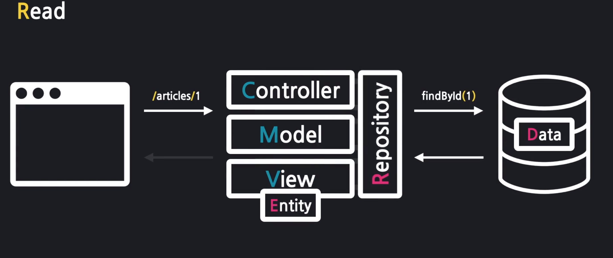

1. PathVariable 
    ```
    @GetMapping("/articles/{id}")
     ```

2. 조회 과정
    - controller
       ```
           // 1. id로 데이터를 가져옴
           Article articleEntity = articleRepository.findById(id).orElse(null); 
           // -> data가 없을 경우 null을 반환한다.

           // 2. 가져온 데이터를 모델에 등록
           m.addAttribute("article",articleEntity);

           // 3. 보여줄 페이지 설정
           return "articles/show";
       ```
   - html : Model의 data를 가져온다
       ```
      <tbody>
       {{#article}}
          <tr>
             <th>{{id}}</th>
             <td>{{title}}</td>
             <td>{{content}}</td>
          </tr>
         {{/article}}
       </tbody>
       ```

#### 5. Data 목록 조회
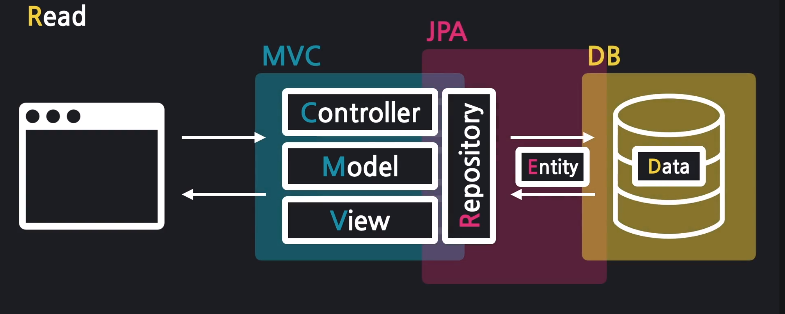

- controller

   ```    
    /*      1. 모든 Article을 가져온다. (반환값 주의)
            - List<Article> articleEntityList =  (List<Article>) articleRepository.findAll();
            - Iterable<Article> articleEntityList =  articleRepository.findAll();
            - @Override
              ArrayList<Article> findAll();
    */
            List<Article> articleEntityList =  articleRepository.findAll();

            // 2. 가져온 Article 묶음을 뷰로 전달
            m.addAttribute("articleList",articleEntityList);

            // 3. 뷰 페이지 설정
            return "articles/index"; // articles/index.mustache
    ```
    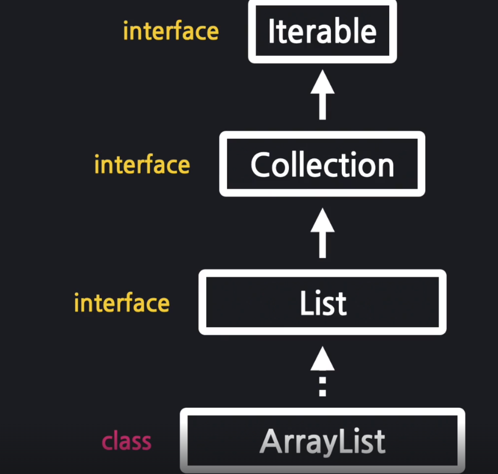

- html : List의 형태로 복수개가 담겨있을 경우 반복해서 출력한다.
    ```
    <tbody>
    {{#articleList}}
        <tr>
            <th>{{id}}</th>
            <td>{{title}}</td>
            <td>{{content}}</td>
        </tr>
    {{/articleList}}
    </tbody>
    ```
<br>

#### 6. Link & redirect

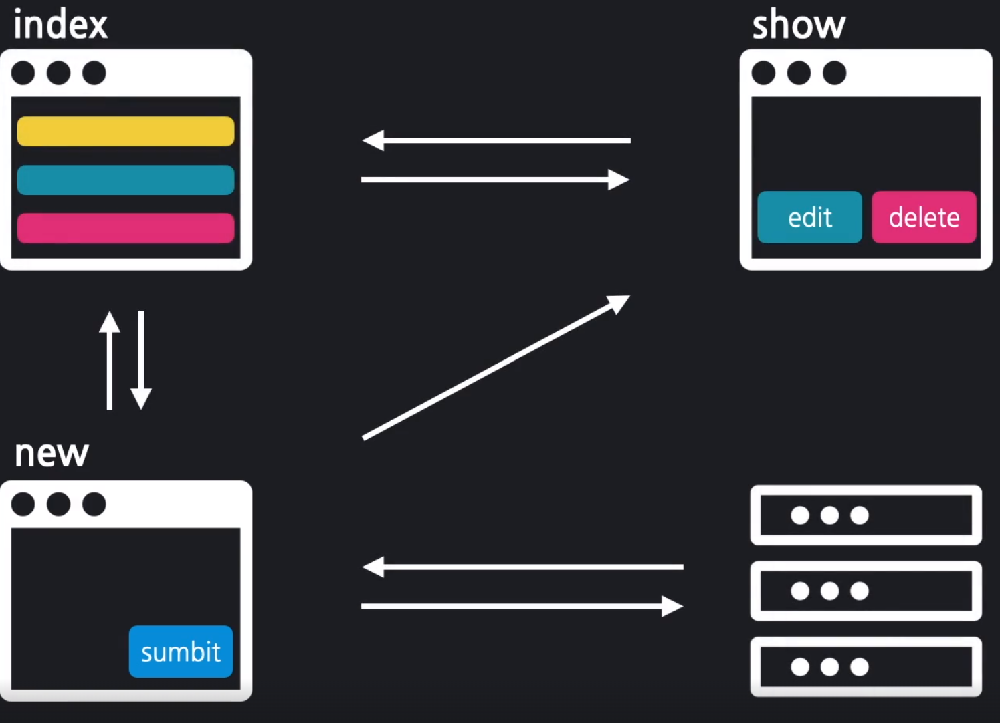

<b>페이지 간의 이동을 연결한다</b>.

<br>

- Link : 
  - for Request (보다 편리한 요청)
  - 미리 정해놓은 요청을 간편히 전송
  - `<a></a>` `<form></form>`
  
<br>
  
- Redirect : for Response (보다 편리한 응답)
  - 클라이언트에게 재 요청을 지시한다

  <br>
  &nbsp;&nbsp;&nbsp;&nbsp;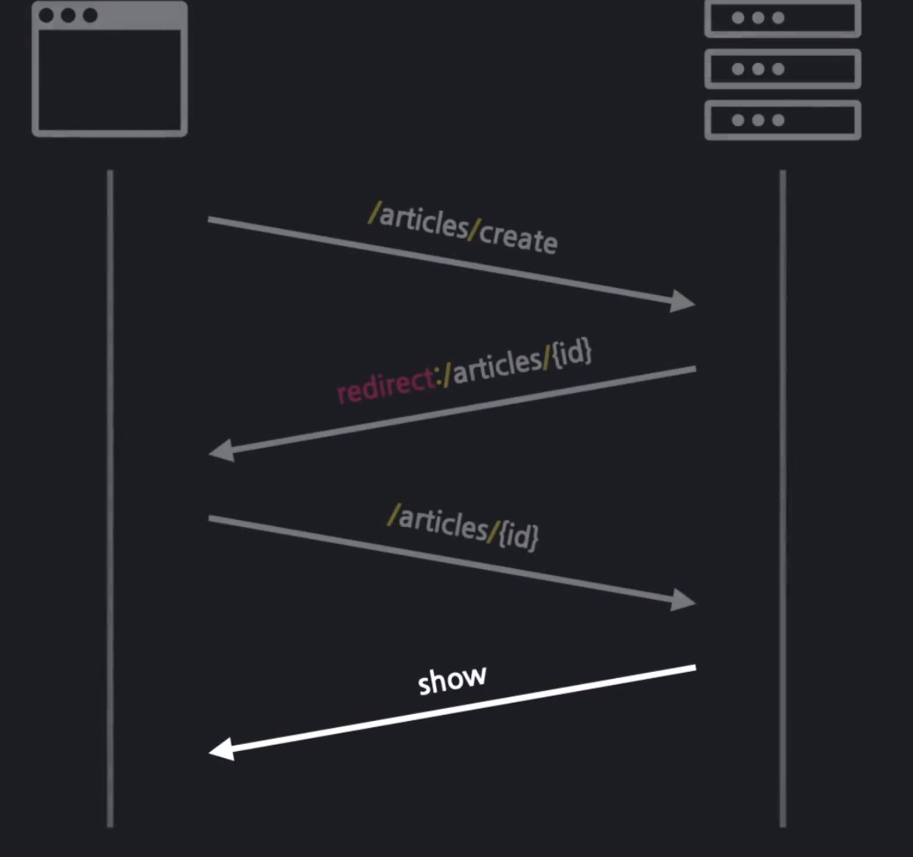

#### 7. 수정 Form
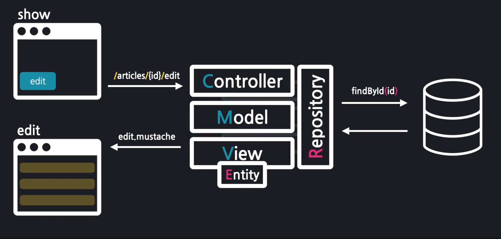

- controller

   ```    
    // 수정할 데이터 가져오기
        Article articleEntity = articleRepository.findById(id).orElse(null);

     // 모델에 데이터 등록
        m.addAttribute("article",articleEntity);

    // view page 설정
        return "articles/edit";
    ```

<br> 

- html : {{#modelVariable}}로 감싸주면 모델 변수를 바로 사용 가능하다. 
    ```
    <form class="container" action="" method="post">
        {{#article}}
            <div class="mb-3">
                <label class="form-label">제목</label>
                <input name="title" type="text" class="form-control">
            </div>
            <div class="mb-3">
                <label class="form-label">내용</label>
                <textarea name="content" class="form-control" rows="3"></textarea>
            </div>
            <button type="submit">수정하기</button>
            <a href="/articles/{{article.id}}"> Back </a>
         {{/article}}
    </form>
    ```
<br>

#### 8. DB 수정


1. sql dumeValue 값 자동 생성 (propertices)

        ```
        spring.jpa.defer-datasource-initialization=true
        ```
2. controller

   ```
   public String update(ArticleForm form){
        log.info(form.toString());

        // 1. dto를 entity로 변환
        Article articleEntity = form.toEntity();

        // 2. entity를 DB에 저장
        // 2-1 : DB에서 기존 데이터를 가져온다
        Article target = articleRepository.findById(articleEntity.getId()).orElse(null);

        // 2-1 : 기존 데이터에 값을 갱신한다

        if(target != null){
            articleRepository.save(articleEntity);
            log.info("성공");
        }
        // 3. 수정 결과 페이지로 redirect
        return "redirect:/articles/" + articleEntity.getId();
    }
    ```

<br> 

#### 9. Data 삭제

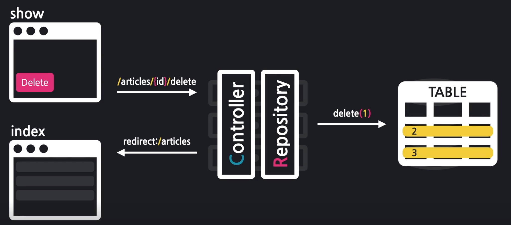


- addFlashAttributes : redirect 1회성 Data 등록

- controller

   ``` java
    public String delete(@PathVariable Long id, RedirectAttributes rttr){

        // 1. 삭제 대상을 가져온다
        Article target = articleRepository.findById(id).orElse(null);
        log.info(target.toString());

        // 2. 대상을 삭제한다
        if(target != null){
            articleRepository.delete(target);
            log.info("정상적으로 삭제되었습니다.");
            rttr.addFlashAttribute("msg","삭제가 완료되었습니다.");
        }

        // 결과 페이지로 리다이렉트 한다
        return "redirect:/articles";
    }
    ```
  
#### 10. SQL Query
1. Query : DB 수행 요청 구문
2. Query Loggin 설정
    ``` properties
   # JPA 로깅 설정
    logging.level.org.hibernate.SQL=DEBUG


    # JPA 로깅 설정-log 정리
    spring.jpa.properties.hibernate.format_sql=true


    # JPA 로깅 설정-parameter 출력
    logging.level.org.hibernate.type.descriptor.sql.BasicBinder=TRACE
   ```
3. H2 DB 고정값 설정  
    ```properties
    # H2 DB URL 고정 설정

    # 유니크 URL 설정 off
    spring.datasource.generate-unique-name=false
    
    # 고정 url 설정
    spring.datasource.url=jdbc:h2:mem:testdb
   ```

4. 종류
   1. select
      ```sql
           select
              article0_.id as id1_0_0_,
              article0_.content as content2_0_0_,
              article0_.title as title3_0_0_ 
           from
              article article0_ 
           where
              article0_.id=?
      ```
   2. insert
      ```sql
       insert 
       into
           article
           (id, content, title) 
       values
           (default, ?, ?)
      ```
    3. update
      ```sql
       update
           article 
       set
           content=?,
           title=? 
       where
           id=?
      ```
    4. delete
      ```sql
    delete
    from
        article
    where
        id=?
      ```
   
<br>

## REST API & JSON

#### REST API
- 웹 서버의 자원을 클라이언트에 구애받지 않고 사용할 수 있도록 하는 설계 방식
- HTTP를 통해 서버의 자원을 다루게 하는 기술
    
#### JSON과 XML
- xml : 사용자 정의형 html
- json : 자바스크립트 방식을 차용한 객체 표현식
- exSite : https://jsonplaceholder.typicode.com/

#### Status
- 200 : 응답 성공
- 201 : 데이터 생성 완료
- 404 : 찾을 수 없는 페이지 요청
- 500 : 서버 내부 에러 발생

#### Test 확인
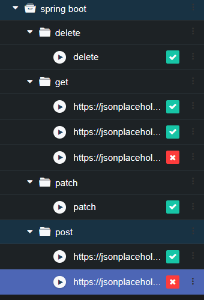

## Http & RestController

#### HTTP 요청 구조

1. 요청
    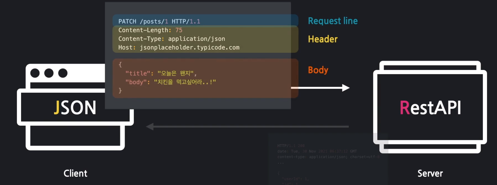
2. 응답 
    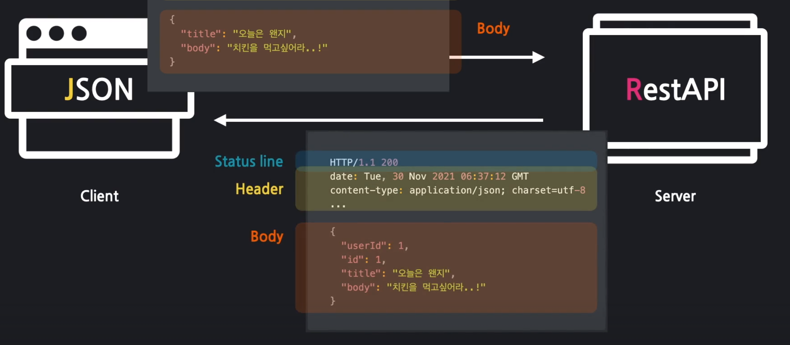

<br><br><br>


#### RestAPI 설계
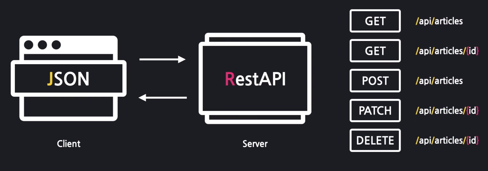
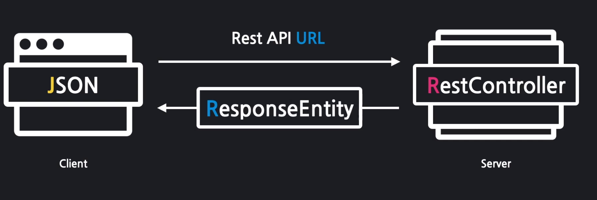

1. RestController와 Controller의 차이 : 반환하는 타입이 다르다 (View page, JSON)
2. RestAPI
   1. Get : Controller 동일
   2. Post
       ```
        @PostMapping("/articles")
        public Article create(@RequestBody ArticleForm dto){
             // @RequestBody 를 통해 Request의 body에 있는 내용을 ArticleForm에 담는다.
             Article article = dto.toEntity();
             return articleRepository.save(article);
         }
       ```
   3. fatch
      ``` 
       // 1. 수정용 엔티티 생성
       Article article = dto.toEntity();
       log.info("id : {} , article : {}",id, article.toString());
   
       // 2. 대상 엔티티를 조회
       Article target = articleRepository.findById(id).orElse(null);
       
       // 3. 잘못된 요청 처리 ( 대상이 없거나 id가 다른 경우 )
       if(target == null || !id.equals(article.getId())){
      
       // 400, 잘못된 요청 응답
           log.info("잘못된 요청 입니다 => id : {} , article : {}",id, article.toString());
           return ResponseEntity.status(HttpStatus.BAD_REQUEST).body(null);
        }
       // 4. 업데이트 및 정상 응답 (200)
       target.patch(article);
   
       Article updated = articleRepository.save(target);
       return ResponseEntity.status(HttpStatus.OK).body(updated);
      ```
   4. delete
      ```
       // 대상 찾기
       Article target =  articleRepository.findById(id).orElse(null);
   
       // 잘못된 요청 처리
       if(target == null){
           return ResponseEntity.status(HttpStatus.BAD_REQUEST).body(null);
       }
   
       // 대상 삭제
       articleRepository.deleteById(id);
       return ResponseEntity.status(HttpStatus.OK).build();
       ```
      
    5. Test 내역
   
        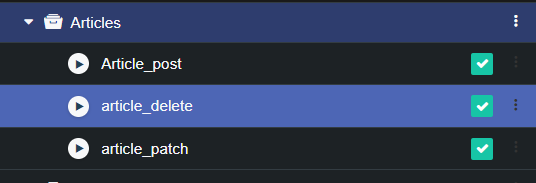 

    <br>


## Service 계층과 Transaction

#### Service 
- Controller Repository 사이에 위치하는 계층
- 처리 업무의 순서를 총괄

    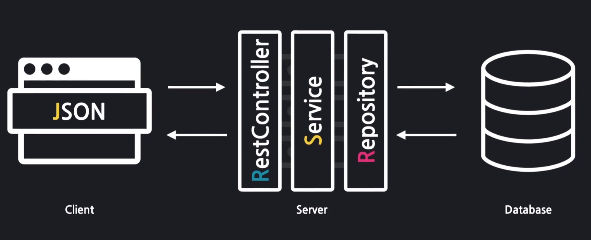


#### Transaction
- 모두 성공 해야 하는 일련의 과정
- 실패시 진행 초기 단계로 돌아간다.(롤백)
- @Transactional // 해당 메서드를 트랜잭션으로 묶는다 (Service method)


## Test
- 프로그램의 품질 검증을 위한 것으로 의도대로 프로그램이 동작하는지를 검증하는 것
- TDD : 테스트 코드를 먼저 만들고, 이를 통과하는 최소한의 코드로 시작해 점진적으로 개선 및 확장해나가는 개발 방식

    <br>
         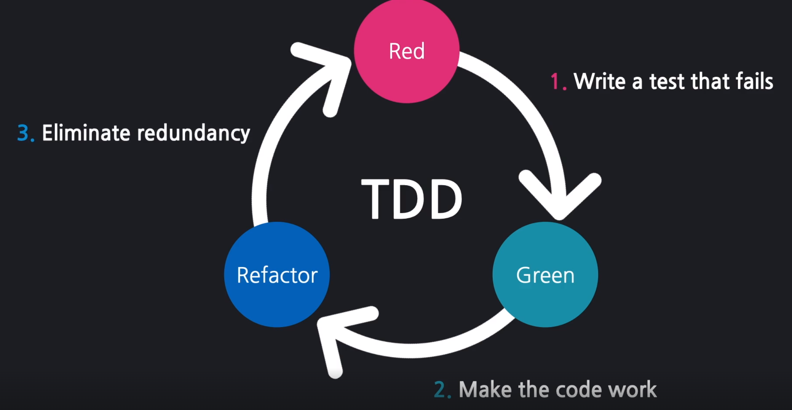

1. Test 과정 
   1. 예상 시나리오 작성
   2. 실제 코드 비교
   3. 검증
   4. 디버깅 및 리팩토링
      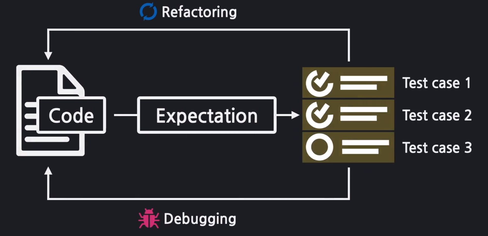

2. TestCase
   1. select
      - index(전체 목록 가져오기)
      - show_성공(존재하는_id_입력)
      - show_실패(존재하지 않는 id 입력)
   
   2. insert
      - create_성공(title과 content만 있는 dto 입력)
      - create_실패(id가 포함된 dto 입력) 

   3. update
      - update_성공(존재하는 id와 title_content 가 있는 dto 입력)
      - update_성공(존재하는 id와 title만 있는 dto 입력)
      - update_실패(존재하지 않는 id의 dto 입력)
      - update_실패(id가 다른 dto 입력)

   4. delete
      - delete_성공(존재하는 id 입력)
      - delete_실패(존재하지 않는 id 입력)
    
    <br>
   
    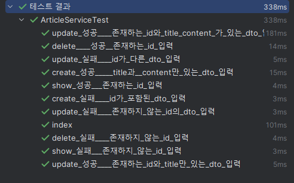    

<br>

## 댓글
1. CommentEntity
    - 게시글과 댓글의 관계는 1:N 관계
    - ManyToOne : 해당 댓글 엔티티 여러개가, 하나의 Article의 대표값을 저장
    - @JoinColumn(name = "article_id") : "articleid" 컬럼에 Article의 대표값을 저장
    - ex
        ```
        -- 4번 게시글의 모든 댓글 출력
        select *  from comment where article_id = 4;
        ```
2. CommentRepository
   - Paging & Sorting 기능 내장

3. Controller
    - 조회, 생성, 수정, 삭제 : 서비스위임 -> 결과 응답 과정

4. Service
   - 조회, 생성, 수정, 삭제 
     1. 해당 게시글 및 댓글 조회 예외 발생
     2. 댓글 엔티티 생성 (생성)
     3. 엔티티 저장, 수정, 삭제 (생성, 수정, 삭제)
     4. DTO 변환 및 반환 (조회, 생성, 수정, 삭제)
5. View
    - RestApi 통신 방법
        ```javascript
      
        ```


6. Test
    1. TestCase
       - FindById
         - Case 1 : 4번 게시글의 모든 댓글 조회 
         - Case 2 : 1번 댓글의 모든 댓글 조회
         - Case 3 : 9번 게시글의 모든 댓글 조회
         - Case 4 : 9999번 게시글의 모든 댓글 조회
         - Case 5 : -1번 게시글의 모든 댓글 조회
         - 결과
         
           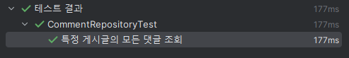
   
       - FindByNickname
         - Case 1 : 박의 모든 댓글 조회
         - Case 2 : 김의 모든 댓글 조회
         - Case 2 : 김의 모든 댓글 조회
         - Case 3 : null의 모든 댓글 조회
         - Case 4 : ""의 모든 댓글 조회
         - Case 5 : "i"의 모든 댓글 조회
         - 결과
         
           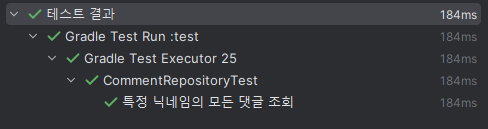

    
## Spring 핵심 개념
#### 1. 외부 DB 연동
1. DBMS
2. DMBS Driver
   ```build.gradle
   runtimeOnly 'org.postgresql:postgresql'
   ```
3. DB Information
   ```properties
    # PostGreSql 연동
    spring.datasource.url=jdbc:postgresql://localhost:5432/firstproject_db
    spring.datasource.username=postgres
    spring.datasource.password=postgres
    
    # 초기화 정보 위치
    spring.sql.init.data-locations=classpath:data.sql
    
    # 서버 실행시 data.sql을 항상 수행(always) # 초기화하지 않겠다
    spring.sql.init.mode=never
    
    # 서버가 켜질 때 테이블과 데이터가 생성되고 꺼질 때 데이터를 모두 DROP한다 create-drop
    spring.jpa.hibernate.ddl-auto=update
    ```
    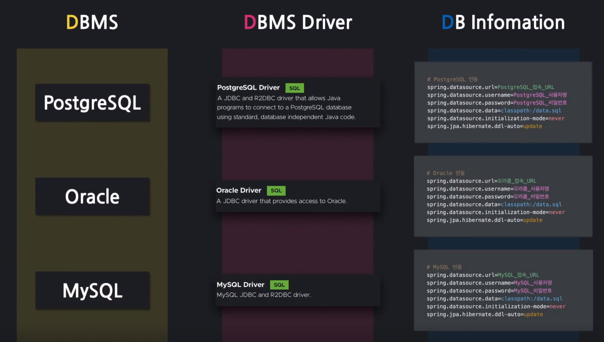

#### 2. IoC와 DI
1. IoC Container 
   - 핵심 객체를 관리하는 창고
   - Controller, Service, Repository등의 다양한 객체들을 만들고 관리
   - 프로그램의 흐름이 개발자의 코드가 아닌 외부에 의해 제어

2. DI 
   - 필요 객체를 외부에서 또 다른 객체로 주입하는 방식
   - 동작에 필요한 객체를 외부에서 받아오는 방식
   - @Autowire를 사용하기 위해서 클래스에 @Component추가

<br>

#### 3. AOP. 관점 지향 프로그래밍
- AOP 
   - 부가 기능을 특정 지점에 잘라넣는 기법
   - 특정 로직을 주입
   - 종류 
     - @Transactional : 문제 발생 시 데이터를 롤백
     - @Aspect : 부가 기능 주입을 위한 AOP 클래스 선언
     - @Pointcut : 주입 대상 지정
     - @Before : 대상 실행 이전에 수행
     - @After : 대상 실행 후 수행
     - @AfterReturning : 대상 실행 후 수행 (정상 수행 시)
     - @AfterThrowing : 대상 실행 후 수행 (예외 발생 시)
     - @Around : 대상 실행 전후로 수행

- 실습 
  - [annotation](firstproject/firstproject/src/main/java/com/example/firstproject/annotation)
  - [aop](firstproject/firstproject/src/main/java/com/example/firstproject/annotationaop)

<br>


#### 4. ObjectMapper

- Jackson lib
- ObjectMapper.writeValueAsString(JSON으로 만들 클래스 타입) : java -> json
- ObjectMapper.readValue(JSON, JSON으로 만들 클래스 타입) : json -> java

<br>


## Error 정리
<details>
    <summary> 자세히 </summary>
   
1. 댓글
    - commentEntity의 Article에서 ManyToOne이 아닌 OnToMany 오타 발생    
       &rarr; 컨네이너 에러 발생됨을 확인   
   
    - Json property를 article_id로 보내었는데 Dto는 articleId인 경우 오류 발생
      &rarr; #Jsonproperty("article_id)를 추가함

        
</details>


출처: [개념은 호옹~, 실습 빡] 스프링 부트, 입문!-흥팍    
https://www.inflearn.com/users/85824/@hongpark

