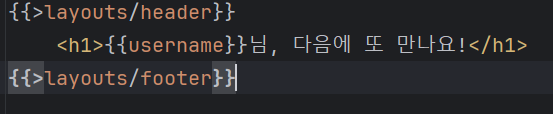

# EX_Spring

## 목차
1. [WebService 동작 원리](#web-service-동작원리)
2. [Vue Templete & MVC Patten](#vue-템플릿-과-mvc-패턴)
3. [layout 나누기](#layout-나누기-)
4. [게시판](#게시판)

[//]: # (| Week | 학습여부   | 커리큘럼 내용                                 |)

[//]: # (| ----- |--------|-----------------------------------------|)

[//]: # (| 1주차 | ☑️     | iOS 기초, H.I.G를 통한 컴포넌트의 이해, 화면 전환       |)

[//]: # (| 2주차 | ☑️     | Autolayout을 통한 기초 UI구성, Scroll View의 이해 |)

[//]: # (| 3주차 | ☑️     | TableView, CollectionView, 데이터 전달 방식    |)

[//]: # (| 4주차 | ☑️     | Cocoapods & Networking + 솝커톤 전 보충 세미나   |)

[//]: # (| 5주차 |        | 디자인 합동 세미나                              |)

[//]: # (| 6주차 |        | 서버 합동 세미나 + 솝커톤                         |)

[//]: # (| 7주차 |        | 클론 코딩을 통한 실전 UI 구성, Animation, 통신 보충    |)

[//]: # (| 8주차 |        | e기획 경선 + 앱잼 전 보충 세미나 + 앱스토어 배포 가이드      |)


### Web Service 동작원리
- 클라이언트 : 서비스를 사용하는 프로그램 또는 컴퓨터
- 서버 : 서비스를 제공하는 프로그램 또는 컴퓨터  

&nbsp; &rarr;
클라이언트가 서버에 요청을 하게 되면 서버는 해당 요청을 응답으로 전해준다.

### Vue 템플릿과 MVC 역할
<details>
<summary>자세히 보기</summary>

- Vue 템블릿 : 화면을 담당하는 기술  
  - 틀이되는 페이지가 변수의 값에 따라서 수많은 페이지로 바뀔 수 있음
  - Controller : 처리
  - Model : data
  - Mustache : Vue 템블릿 엔진   


- MVC 패턴 : 화면, 처리, 데이터 분야를 각 담당자별로 나누는 기법

<br>

- MVC 역할 

  <br>
  
  클라이언트 :
  http://localhost:8080/hi   
  &nbsp; &nbsp; &nbsp; &nbsp; &nbsp; &nbsp; &nbsp; &darr;
  ```java
  @Controller
  public class FirstController {

    @GetMapping("/hi")
    public String niceToMeetYou(Model model){
        model.addAttribute("username","seoin");
        return "greetings"; // templates/greetings.mustache -> 브라우저로 전송!
    }
  }
  ```
  &nbsp; &nbsp; &nbsp; &nbsp; &nbsp; &nbsp; &nbsp; &darr;
  <table>
  <tr>
    <td>key</td>
    <td>value</td>
  </tr>
  <tr><td>username</td><td>seoin</td></tr>
  </table>

  &nbsp; &nbsp; &nbsp; &nbsp; &nbsp; &nbsp; &nbsp; &darr;
  ```html
  <html>
  <head>
      <meta charset="UTF-8">
      <meta name="viewport"
            content="width=device-width, user-scalable=no, initial-scale=1.0, maximum-scale=1.0, minimum-scale=1.0">
      <meta http-equiv="X-UA-Compatible" content="ie=edge">
      <title>Document</title>
  </head>
  <body>
      <h1>{{username}}님, 반갑습니다!</h1>
  </body>
  </html>
  ```
  &nbsp; &nbsp; &nbsp; &nbsp; &nbsp; &nbsp; &nbsp; &darr;

  <br>

  

</details>

### layout 나누기 
- herder : 사이트 안내 (네비게이션) 
- footer : 사이트 정보 (site info)

  
  

- 템플릿화 
   
   <br> 

  &nbsp;&nbsp;&nbsp;&nbsp;&nbsp;&nbsp;&nbsp;&nbsp;&darr; 
  
  <br>
  
 

### 게시판

- DTO : Form Data,를 받는 객체
- 
1. Form 데이터 주고받기 : HTML Form Data를 주고 받기


